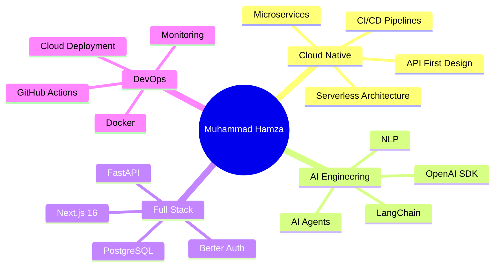

<div align="center">

# 👋 Hey, I'm Muhammad Hamza


<p align="center">
  <a href="https://github.com/Hamza123545"></a>
  <a href="https://linkedin.com/in/yourprofile"></a>
  <a href="mailto:your.email@example.com"></a>
  <a href="https://yourportfolio.vercel.app"></a>
</p>


</div>

---

## 🚀 About Me

```python
class CloudNativeDeveloper:
    def __init__(self):
        self.name = "Muhammad Hamza"
        self.role = "Full Stack Cloud-Native Developer & AI Engineer"
        self.location = "Pakistan 🇵🇰"
        self.language_spoken = ["en_US", "ur_PK"]
        
    def current_work(self):
        return {
            "focus": [
                "Building AI-Powered Cloud Applications",
                "Serverless Architecture & Microservices",
                "AI Agent Development & Orchestration"
            ],
            "learning": [
                "Physical AI & Edge Computing",
                "Advanced Cloud-Native Patterns",
                "Multi-Agent Systems"
            ]
        }
    
    def tech_stack(self):
        return {
            "backend": ["Python", "FastAPI", ".NET", "Node.js"],
            "frontend": ["Next.js 16", "React", "TypeScript", "TailwindCSS"],
            "ai_ml": ["OpenAI SDK", "LangChain", "Agents SDK", "ChatKit"],
            "cloud": ["Vercel", "AWS", "Neon DB", "Supabase"],
            "tools": ["Docker", "Git", "PostgreSQL", "REST APIs"]
        }
    
    def available_for(self):
        return ["💼 Freelance Projects", "🤝 Collaborations", "🌟 Open Source"]

me = CloudNativeDeveloper()
```

---

## 💻 Tech Arsenal

<div align="center">

### Languages & Frameworks


### Frontend Development


### Backend & APIs


### Cloud & Database


### AI & ML Stack


### DevOps & Tools


</div>

---

## 🎯 Featured Projects

<table>
<tr>
<td width="50%">

### 🚀 [Todo Five Phases](https://github.com/Hamza123545/Todo_giaic_five_phases)
**Enterprise-Grade Task Management with AI**

Production-ready cloud-native application demonstrating modern full-stack architecture with AI integration.

**Highlights:**
- ✅ Next.js 16 App Router + Server Components
- ✅ FastAPI backend with async PostgreSQL
- ✅ Better Auth (OAuth, JWT, 2FA)
- ✅ AI Chatbot with OpenAI ChatKit
- ✅ MCP Server for AI tool integration
- ✅ Neon serverless PostgreSQL
- ✅ Full CI/CD on Vercel

**Tech:** `Next.js` `FastAPI` `PostgreSQL` `OpenAI` `Better Auth`

🔗 **[Live Demo](https://todo-giaic-five-phases.vercel.app)** | ⭐ **71 Repos**

</td>
<td width="50%">

### 📚 [Physical AI Book Platform](https://github.com/Hamza123545/physical-ai-book)
**Interactive Learning Platform**

Modern documentation platform for Physical AI concepts with GitHub Pages deployment.

**Highlights:**
- 📖 Interactive documentation
- 🎨 Modern UI/UX design
- 📱 Fully responsive
- ⚡ Fast static site generation
- 🔍 Search functionality

**Tech:** `TypeScript` `Next.js` `GitHub Pages`

🔗 **[View Project](https://hamza123545.github.io/physical-ai-book)**

</td>
</tr>

<tr>
<td width="50%">

### 🔐 [Better Auth + FastAPI](https://github.com/Hamza123545/How-to-use-Better-auth-with-Python-Fast-Api)
**Modern Authentication Architecture**

Complete authentication solution integrating Better Auth with Python backends.

**Highlights:**
- 🔒 JWT token verification
- 👤 User session management
- 🔑 OAuth integration
- 🛡️ Security best practices
- 📚 Comprehensive documentation

**Tech:** `Better Auth` `FastAPI` `JWT` `SQLModel`

</td>
<td width="50%">

### 🔒 [Secure Encryption System](https://github.com/Hamza123545/Secure-Data-Encryption-System)
**Cloud-Deployed Security Application**

Production encryption/decryption system with modern web interface.

**Highlights:**
- 🔐 AES-256 encryption
- 🌐 Web-based interface
- ☁️ Cloud deployment
- 📤 File upload/download
- 🎨 Clean UI with Streamlit

**Tech:** `Python` `Streamlit` `Cryptography`

🔗 **[Live App](https://secure-data-encryption-system-rpf9v4gfbhh7uu8rtpx2cq.streamlit.app/)**

</td>
</tr>
</table>

---

## 🤖 AI & Agent Development

<div align="center">

| Project | Description | Technologies |
|---------|-------------|--------------|
| 🎓 **[Smart Student Agent](https://github.com/Hamza123545/Smart_Student_Agent)** | AI academic assistant with Q&A, study tips, and text summarization | OpenAI Agents SDK, Chainlit, Python |
| 💊 **[Health Advisor Agent](https://github.com/Hamza123545/Health_Advisor_Agent)** | Intelligent health advisory and recommendation system | Python, AI/ML, NLP |
| 🧪 **[Practice Agents](https://github.com/Hamza123545/Practice-Agents)** | Experimental AI agent development and orchestration patterns | Python, OpenAI SDK, Multi-Agent Systems |
| 🛒 **[E-Commerce Chatbot](https://github.com/Hamza123545/Chatbot-Online-assistant-)** | Shopping assistant with product recommendations | Python, NLP, Conversational AI |

</div>

---

## 📊 GitHub Statistics

<div align="center">
  
  
</div>

<div align="center">
  
</div>

<div align="center">
  
</div>

---

## 🏆 GitHub Achievements

<div align="center">
  
</div>

---

## 💡 Expertise Areas

<div align="center">



</div>

### 🎯 Core Competencies

<table>
<tr>
<td width="33%" valign="top">

**☁️ Cloud-Native Architecture**
- Serverless design patterns
- Microservices architecture
- API-first development
- Event-driven systems
- Database as a Service
- Automated CI/CD pipelines
- Infrastructure as Code

</td>
<td width="33%" valign="top">

**🤖 AI & Machine Learning**
- AI Agent development
- OpenAI Agents SDK
- LangChain integration
- Model Context Protocol
- Conversational AI systems
- Natural Language Processing
- Prompt engineering

</td>
<td width="33%" valign="top">

**💻 Full-Stack Development**
- Next.js 16 App Router
- React Server Components
- FastAPI async patterns
- PostgreSQL optimization
- Better Auth integration
- Real-time applications
- RESTful API design

</td>
</tr>
</table>

---

## 📈 Contribution Graph

<div align="center">


</div>

---

## 🎓 Learning Journey

<div align="center">

### Currently Exploring

<table>
<tr>
<td align="center" width="25%">

<br><strong>Physical AI</strong>
<br><sub>Edge Computing & Robotics</sub>
</td>
<td align="center" width="25%">

<br><strong>MCP Servers</strong>
<br><sub>Model Context Protocol</sub>
</td>
<td align="center" width="25%">

<br><strong>Kubernetes</strong>
<br><sub>Container Orchestration</sub>
</td>
<td align="center" width="25%">

<br><strong>Multi-Agent Systems</strong>
<br><sub>Agent Orchestration</sub>
</td>
</tr>
</table>

</div>

---

## 🌟 Recent Highlights

- 🚀 **Built Todo Five Phases** - Full-stack cloud-native app with AI integration
- 🤖 **Developed Multiple AI Agents** - Using OpenAI Agents SDK and Chainlit
- 🔐 **Implemented Better Auth** - Integrated with Python FastAPI backend
- 📚 **Created Physical AI Platform** - Interactive learning documentation
- ☁️ **Deployed to Production** - Multiple projects live on Vercel & Streamlit Cloud
- 🎯 **71 Public Repositories** - Active contributor to open source

---

## 📫 Let's Connect & Collaborate

<div align="center">

### 💼 Open for Opportunities

I'm available for **freelance projects**, **collaborations**, and **consultations** in:

🔹 **Cloud-Native Application Development**  
🔹 **AI Agent & Chatbot Development**  
🔹 **Full-Stack Web Applications**  
🔹 **API Development & Integration**  
🔹 **Technical Architecture & Consulting**

<br>

### 📬 Get in Touch

<table>
<tr>
<td align="center">
<a href="https://linkedin.com/in/yourprofile">

<br>Professional Network
</a>
</td>
<td align="center">
<a href="mailto:your.email@example.com">

<br>Direct Contact
</a>
</td>
<td align="center">
<a href="https://yourportfolio.vercel.app">

<br>View My Work
</a>
</td>
<td align="center">
<a href="https://twitter.com/yourhandle">

<br>Follow Me
</a>
</td>
</tr>
</table>

<br>

### ⭐ Show Your Support

If you like my work, consider giving a ⭐ to my repositories!

<br>

---


<div align="center">

**"Building the future, one cloud-native application at a time"** ☁️🚀

*Crafted with 💚 by Muhammad Hamza*


</div>

</div>
