<div align="center">


</div>

<div align="center">

## 👨‍💻 Cloud-Native Developer | 🤖 AI Engineer | 🚀 Full Stack Developer


</div>

<div align="center">

[](https://www.linkedin.com/in/muhammad-hamza-507761274)
[](mailto:hswati517@gmail.com)
[](https://new-protfolio-blush.vercel.app)
[](https://twitter.com/hamzaswati782)


</div>

<br>


<br>

##  About Me


```python
class MuhammadHamza:
    
    def __init__(self):
        self.username = "Hamza123545"
        self.name = "Muhammad Hamza"
        self.location = "Pakistan 🇵🇰"
        self.role = "Cloud-Native Developer & AI Engineer"
        
    def get_stack(self):
        return {
            "backend": ["Python", "FastAPI", ".NET", "Node.js"],
            "frontend": ["Next.js 16", "React", "TypeScript"],
            "ai_ml": ["OpenAI SDK", "LangChain", "ChatKit"],
            "cloud": ["Vercel", "AWS", "Neon DB"],
            "databases": ["PostgreSQL", "SQLite", "Supabase"],
            "devops": ["Docker", "Git", "CI/CD"]
        }
    
    def get_current_focus(self):
        return [
            "🎯 Building AI-Powered Cloud Applications",
            "☁️ Serverless Architecture & Microservices",
            "🤖 AI Agent Development & Orchestration",
            "📚 Learning Physical AI & Edge Computing"
        ]
    
    def say_hi(self):
        print("Thanks for visiting! Let's build something amazing together!")

me = MuhammadHamza()
me.say_hi()
```

<br>

### 🎯 Quick Highlights

```mermaid
graph LR
    A[💼 71+ Repositories] --> B[🚀 Multiple Live Projects]
    B --> C[🤖 AI Integration Expert]
    C --> D[☁️ Cloud-Native Specialist]
    D --> E[🌟 Open Source Contributor]
    style A fill:#00D9FF,stroke:#333,stroke-width:2px,color:#000
    style B fill:#00E676,stroke:#333,stroke-width:2px,color:#000
    style C fill:#FFD700,stroke:#333,stroke-width:2px,color:#000
    style D fill:#FF6B6B,stroke:#333,stroke-width:2px,color:#000
    style E fill:#A78BFA,stroke:#333,stroke-width:2px,color:#000
```



<br>


<br>

##  Tech Arsenal

<div align="center">

### 🎨 Frontend Development


### ⚙️ Backend & APIs


### 🤖 AI & Machine Learning


### ☁️ Cloud & Database


### 🛠️ Tools & DevOps


</div>

<br>


<br>

##  Featured Projects

<div align="center">

<table>
<tr>
<td width="50%" valign="top">

### 🚀 [Todo Five Phases](https://github.com/Hamza123545/Todo_giaic_five_phases)

<a href="https://todo-giaic-five-phases.vercel.app">
  
</a>

**Enterprise Task Management with AI**

🎯 Full-stack cloud-native application  
✨ Next.js 16 + FastAPI architecture  
🤖 AI Chatbot with OpenAI ChatKit  
🔐 Better Auth (OAuth, JWT, 2FA)  
🗄️ Neon PostgreSQL database  
📡 MCP Server integration  
☁️ Serverless deployment on Vercel

**Stack:** `Next.js` `FastAPI` `PostgreSQL` `OpenAI` `Better Auth`

</td>
<td width="50%" valign="top">

### 📚 [Physical AI Book Platform](https://github.com/Hamza123545/physical-ai-book)

<a href="https://hamza123545.github.io/physical-ai-book">
  
</a>

**Interactive Learning Platform**

📖 Modern documentation interface  
🎨 Beautiful responsive design  
⚡ Fast static site generation  
🔍 Advanced search features  
🌐 GitHub Pages deployment  
📱 Mobile-optimized experience

**Stack:** `TypeScript` `Next.js` `GitHub Pages`

</td>
</tr>

<tr>
<td width="50%" valign="top">

### 🔐 [Better Auth + FastAPI](https://github.com/Hamza123545/How-to-use-Better-auth-with-Python-Fast-Api)

**Modern Authentication Architecture**

🔒 JWT token verification  
👤 User session management  
🛡️ OAuth 2.0 integration  
🔑 Secure password handling  
📚 Complete documentation  
✅ Production-ready patterns

**Stack:** `Better Auth` `FastAPI` `JWT` `SQLModel`

</td>
<td width="50%" valign="top">

### 🔒 [Secure Encryption System](https://github.com/Hamza123545/Secure-Data-Encryption-System)

<a href="https://secure-data-encryption-system-rpf9v4gfbhh7uu8rtpx2cq.streamlit.app/">
  
</a>

**Cloud Encryption Application**

🔐 AES-256 encryption  
🌐 Web-based interface  
📤 File upload/download  
☁️ Streamlit Cloud deployment  
🎨 Clean modern UI  
⚡ Fast processing

**Stack:** `Python` `Streamlit` `Cryptography`

</td>
</tr>
</table>

</div>

<br>

### 🤖 AI Agent Portfolio

<div align="center">

| 🎯 Project | 📝 Description | 🛠️ Tech Stack |
|:-----------|:---------------|:---------------|
| **[Smart Student Agent](https://github.com/Hamza123545/Smart_Student_Agent)** | Academic AI assistant with Q&A and study tips | `OpenAI Agents SDK` `Chainlit` `Python` |
| **[Health Advisor Agent](https://github.com/Hamza123545/Health_Advisor_Agent)** | Intelligent health recommendations system | `Python` `AI/ML` `NLP` |
| **[Practice Agents](https://github.com/Hamza123545/Practice-Agents)** | Multi-agent orchestration experiments | `Python` `OpenAI SDK` `Agent Systems` |
| **[E-Commerce Chatbot](https://github.com/Hamza123545/Chatbot-Online-assistant-)** | Smart shopping assistant with NLP | `Python` `NLP` `Conversational AI` |

</div>

<br>


<br>

##  GitHub Analytics

<div align="center">


</div>

<br>

<div align="center">


</div>

<br>

## 🏆 GitHub Trophies

<div align="center">


</div>

<br>


<br>

## 💼 What I Bring to the Table

<div align="center">

<table>
<tr>
<td width="33%" align="center">

### ☁️ Cloud-Native
**Serverless First**

✅ Microservices Architecture  
✅ API-First Development  
✅ Event-Driven Systems  
✅ Auto-Scaling Solutions  
✅ CI/CD Automation

</td>
<td width="33%" align="center">

### 🤖 AI Engineering
**Intelligence Built-In**

✅ AI Agent Development  
✅ LangChain Integration  
✅ OpenAI SDK Expert  
✅ Conversational AI  
✅ NLP Solutions

</td>
<td width="33%" align="center">

### 💻 Full-Stack
**End-to-End Solutions**

✅ Next.js 16 Mastery  
✅ FastAPI Expertise  
✅ Database Optimization  
✅ Auth Implementation  
✅ Real-Time Features

</td>
</tr>
</table>

</div>

<br>


<br>

## 📬 Let's Build Something Amazing Together!

<div align="center">

### 💡 Open for Opportunities

**Freelance Projects** • **Technical Consulting** • **Collaborations** • **Open Source**

<br>

<table>
<tr>
<td align="center" width="25%">
<a href="https://www.linkedin.com/in/muhammad-hamza-507761274">

<br><br>

<br><sub><b>Professional Network</b></sub>
</a>
</td>

<td align="center" width="25%">
<a href="mailto:hswati517@gmail.com">

<br><br>

<br><sub><b>Email Me</b></sub>
</a>
</td>

<td align="center" width="25%">
<a href="https://new-protfolio-blush.vercel.app">

<br><br>

<br><sub><b>View My Work</b></sub>
</a>
</td>

<td align="center" width="25%">
<a href="https://twitter.com/hamzaswati782">

<br><br>

<br><sub><b>Stay Updated</b></sub>
</a>
</td>
</tr>
</table>

<br>

### ⭐ If you like my work, don't forget to give a star to my repositories!

<br>


<br>

**"Turning complex problems into elegant cloud-native solutions"** ☁️✨

<br>


</div>
